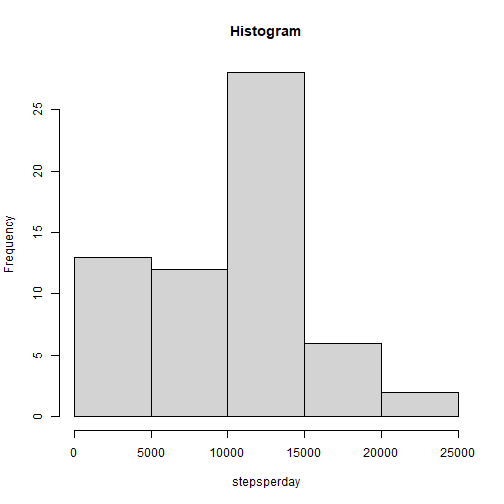
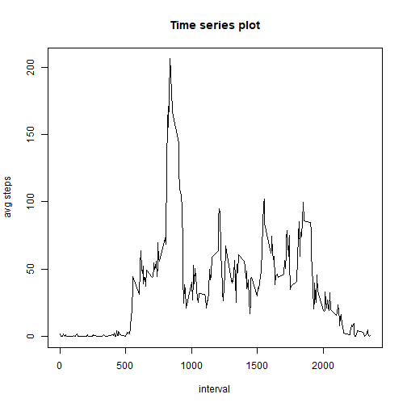
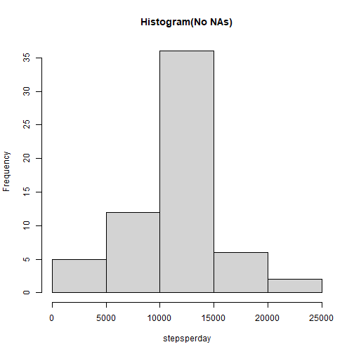
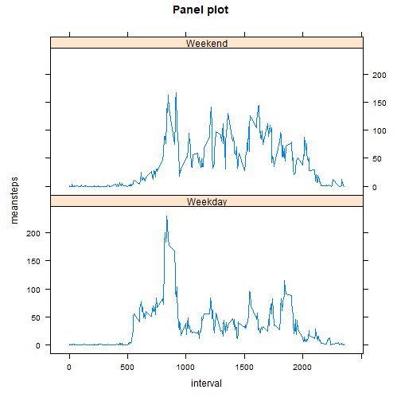

## Loading and preprocessing the data

- Source raw data is unzipped and read,and transformed.


```r
unzip("activity.zip")
activitydata<-read.csv("activity.csv")
activitydata<-transform(activitydata,date=strptime(date,"%Y-%m-%d"))
```

## What is mean total number of steps taken per day?

- preprocessed data is grouped by date and mean total number of steps per day is calculated and plotted as needed.

- stepsperday indicate total steps per each day


```r
groupdata<-group_by(activitydata,date)
summarydata<-summarize(groupdata,stepsperday=sum(steps,na.rm=T))
hist(summarydata$stepsperday,main="Histogram",xlab="stepsperday")
```



- meansteps indicate mean of total steps per day


```r
meansteps<-mean(summarydata$stepsperday,na.rm=T)
meansteps
```

```
## [1] 9354.23
```

- mediannsteps indicate mean of total steps per day


```r
mediansteps<-median(summarydata$stepsperday,na.rm=T)
mediansteps
```

```
## [1] 10395
```

## What is the average daily activity pattern?

- Time series 


```r
grpdailyact<-group_by(activitydata,interval)
avgdailyact<-summarize(grpdailyact,avg_steps=mean(steps,na.rm=T))
with(avgdailyact,plot(interval,avg_steps,type="l",main="Time series plot",ylab="avg steps"))
```



- Interval with maximum of average number of steps


```r
maxinterval<-with(avgdailyact,interval[avg_steps==max(avg_steps)])
maxinterval
```

```
## [1] 835
```

## Imputing missing values

- Total number of missing values(NA) in activity data


```r
totalna<-sum(is.na(activitydata$steps))
totalna
```

```
## [1] 2304
```

- Using Average steps per interval(calculated above), to impute the missing values
- Histogram(after Imputing missing values) is plotted
- Mean & Median of imputed data(In Same order)


```r
imputedata<-merge(activitydata,avgdailyact)
imputedata=mutate(imputedata,steps=ifelse(is.na(steps),as.integer(round(avg_steps)),steps))
groupimputedata<-group_by(imputedata,date)
summaryimpdata<-summarize(groupimputedata,stepsperday=sum(steps))
hist(summaryimpdata$stepsperday,main="Histogram(No NAs)",xlab="stepsperday")
```



```r
meanimpsteps<-mean(summaryimpdata$stepsperday)
meanimpsteps
```

```
## [1] 10765.64
```

```r
mediansteps<-median(summaryimpdata$stepsperday)
mediansteps
```

```
## [1] 10762
```

Imputing has not modified the mean and median significantly.

## Are there differences in activity patterns between weekdays and weekends?


- categorize the data based on weekedn and weekdays
- panel plot for average steps taken per interval across weekdays and weekends


```r
weekctgdata<-mutate(imputedata,category=factor((weekdays(date)=="Saturday" | weekdays(date)=="Sunday"),labels = c("Weekday","Weekend")))
groupctgdata<-group_by(weekctgdata,interval,category)
summaryctgdata<-summarize(groupctgdata,meansteps=mean(steps))
```

```
## `summarise()` has grouped output by 'interval'. You can override using the `.groups`
## argument.
```

```r
xyplot(meansteps~interval|category,summaryctgdata,type="l",layout=c(1,2),main="Panel plot")
```



